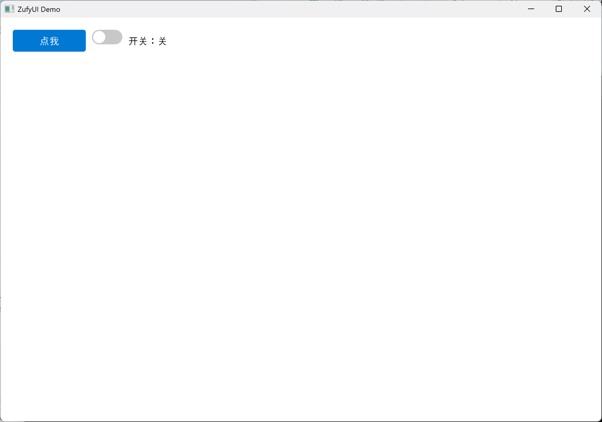
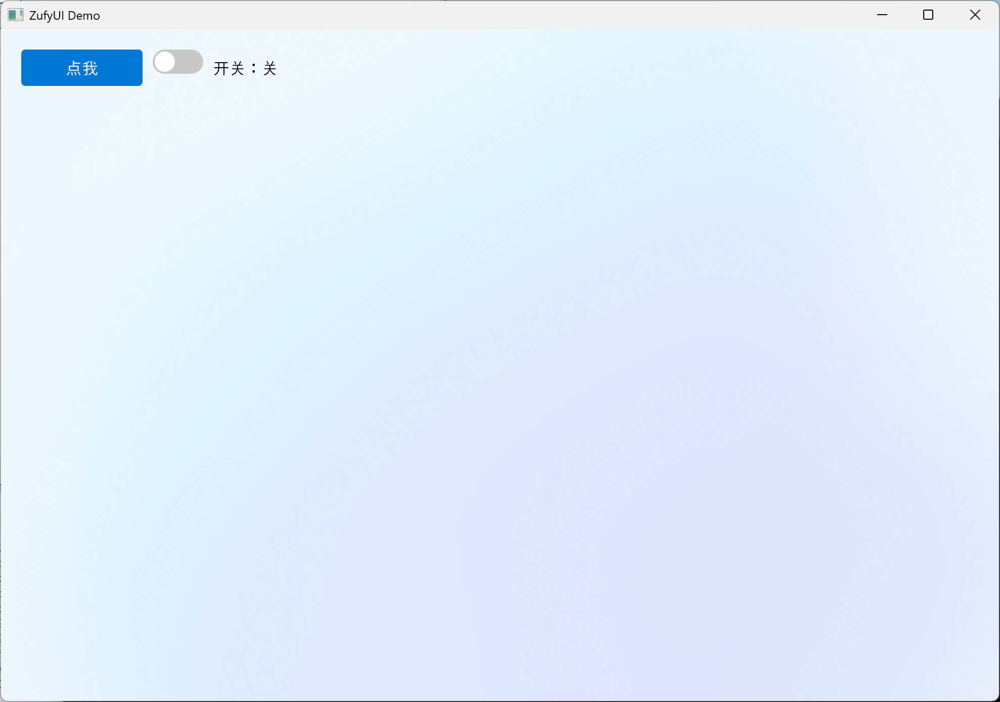
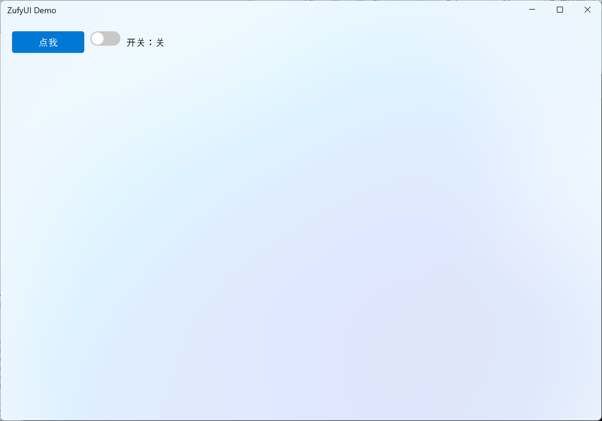
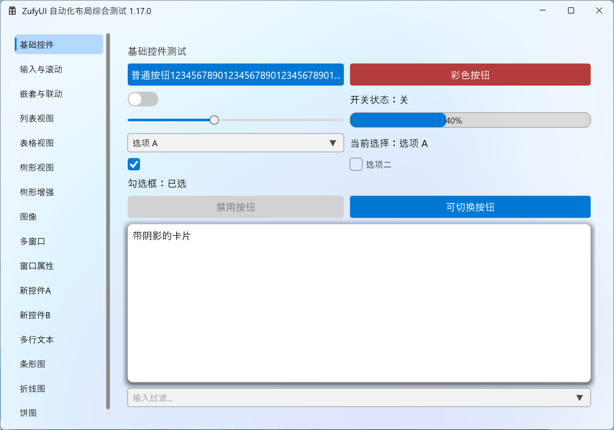

# ZufyUI

> **Renamed: `ZUI` → `ZufyUI`** (to avoid clashes with other projects of the same name). Old repository URLs are redirected by the platform to the new address (see links below).

> A C++ native Win32 custom-drawn UI framework based on Direct2D, with layout, controls, signals/slots, and high-DPI adaptation.

> Language: **English** · [简体中文](README.md)

ZufyUI is a **header-only** Windows desktop UI framework built directly on Direct2D / DirectWrite / DWM. It does not depend on Qt, MFC, or any third-party library; it packs controls, layout, animation, fonts, data views, and signals/slots into a handful of `.h` files, making it suitable for native C++ applications that want a lightweight, controllable, modern look.

- Repository: GitHub <https://github.com/zhc9968/ZufyUI> · Gitee <https://gitee.com/zhc9968/ZufyUI>
- License: MIT
- Online docs: <https://zhc9968.github.io/ZufyUI/>
- API Reference (English): <https://zhc9968.github.io/ZufyUI/docs/API.en.html>

## Features

- **Direct2D custom drawing**: hardware-accelerated rendering, Acrylic background, rounded corners, and shadows for a modern look.
- **Complete layout system**: `ColumnBox` / `RowBox` / `GridLayout`, supporting spacing, stretch weight, fill, alignment, and row/column spanning.
- **Signals and slots**: built-in `ZSignal` / `Connection`, supporting `Connect` with automatic lifetime management, plus three dispatch strategies: current thread / new thread / UI thread.
- **Rich controls**: labels, buttons, text boxes, combo boxes, toggle switches, scroll containers, progress bars, sliders, and three data views: list / table / tree.
- **Complete animation and transitions**: hover, expand, indicator bar, and page switching (`PageHost`) all have built-in animations, and scrolling supports smooth scrolling.
- **High-DPI adaptation**: automatically aware of DPI; `Snap()` snaps drawing to physical pixels to avoid blurriness.
- **IME compatibility**: text boxes support Chinese IME composition input and candidate window positioning.
- **Offscreen caching**: elements can automatically cache their drawing results to reduce repeated drawing overhead.
- **System integration**: tray icon (hover/click/right-click/badge/balloon), taskbar (progress / overlay badge / thumbnail toolbar), jump lists, and **app identity (AUMID) self-registration** (unifies toast / grouping; requires an explicit authorization macro).

## Requirements

| Item | Requirement |
| --- | --- |
| Operating system | Windows 10 / 11 |
| Compiler | Visual Studio (**any toolset works**; requires **C++20** or later) |
| Windows SDK | 10.0 or later |
| Source encoding | **UTF-8 with BOM** (otherwise MSVC parses Chinese comments in the local code page and fails to compile) |
| Runtime libraries | System-provided `d2d1` / `dwrite` / `dwmapi` / `imm32` (no additional installation required) |
| Third-party dependencies | None |

## Build

1. Open the solution `ZufyUI.slnx` with Visual Studio;
2. Select the **Release | x64** configuration;
3. Build the solution (Build Solution);
4. The output is located at `x64\Release\ZufyUI.exe`; run it directly.

Command-line build (requires MSBuild on PATH):

```bash
msbuild ZufyUI.slnx /p:Configuration=Release /p:Platform=x64
```

> `ZufyUI.cpp` is a comprehensive demo program (left-side navigation + multiple test pages) that also serves as the framework's "smoke test". When building your own application, you only need to include the headers and write your own `WinMain`.

## Project structure

```text
ZufyUI/
├── ZufyUI.h              # Core: types / signals & slots / fonts / elements / layout / menus / window
├── ZufyUIWidgets.h       # Basic controls: Label / Button / TextBox / ComboBox / ToggleSwitch / ScrollViewer / ProgressBar / Slider
├── ZDataViewer.h      # Data views: ListView / TableView / TreeView
├── ZufyUI.cpp            # Demo program entry point (WinMain)
├── ZufyUI.slnx           # Solution
├── ZufyUI.vcxproj        # Project file
├── AGENTS.md          # Development principles (incl. "find the root cause before fixing any bug")
└── docs/
    └── API.en.md      # Full API documentation
```

## Quick start

```cpp
#include "ZufyUIWidgets.h"
using namespace ZufyUI;

int WINAPI wWinMain(HINSTANCE, HINSTANCE, LPWSTR, int) {
    Window win;
    if (!win.Create(1000, 700, L"ZufyUI Demo"))
        return 1;

    auto root = win.GetRootColumnBox();
    root->SetSpacing(10);

    auto row = std::make_shared<RowBox>();
    row->SetSpacing(10);

    auto btn = std::make_shared<Button>(L"Click me");
    btn->Connect(btn->Clicked, []() {
        MessageBoxW(nullptr, L"Hello ZufyUI!", L"Info", MB_OK);
    });

    auto toggle = std::make_shared<ToggleSwitch>(false);
    auto state = std::make_shared<Label>(L"Switch: off");
    toggle->Connect(toggle->Toggled, [state](bool on) {
        state->SetText(on ? L"Switch: on" : L"Switch: off");
    });

    row->AddChild(btn);
    row->AddChild(toggle);
    row->AddChild(state);
    root->AddChild(row);

    win.Run();
    return 0;
}
```

Key points:

- `Window::Create` creates the window, initializes Direct2D, applies the Acrylic background, and generates a default root `ColumnBox`;
- Create controls with `std::make_shared<T>()` and attach them to the layout with `AddChild`;
- Bind events with `Connect(signal, slot)`; connections are automatically disconnected when the control is destroyed;
- Finally, call `win.Run()` to enter the message loop.

Result (that exact code above):



### Two more steps

**Step 2: change the background.** Only three backdrop layers exist — `None / Acrylic / Mica` — with an ARGB tint composited on top:

```cpp
win.SetBackdrop(Backdrop::Mica, 0x00000000);   // Mica + fully transparent tint
```



**Step 3: a custom title bar.**

```cpp
#include "ZufyUIWindowTool.h"   // DefaultTitleBar lives here

auto bar = std::make_shared<DefaultTitleBar>();
win.SetCustomTitleBar(bar);
```



A tour of the widgets (first page of the demo):



## Changelog

### 2026-10-03 — Data-view virtualization + cross-thread concurrency hardening (v1.15.0)

**Data views (ListView / TableView / TreeView) virtualization**
- Now **viewport-virtualized**: cell labels are created / arranged / drawn only for visible rows (pooled label reuse), so **millions of rows** no longer blow up the visual tree. `ListView` / `TableView` gain:
  - **Hide**: `SetItemHidden` / `IsItemHidden` / `ClearHidden`;
  - **Filter**: `SetFilter(pred)` (predicate takes the source row) / `ClearFilter`;
  - **View-order sort**: `SetViewComparator` + `SortView` / `ClearViewSort`;
  - **Two coordinate systems**: `VisibleCount` / `SourceOfVisible` / `VisibleOfSource` / `TextAtVisible` / `SetSelectedVisible` / `GetSelectedVisible` (visible order); every other existing API keeps using the **source row**.
- `ListView` data API unified to **`*Item*`** (`SetItemCount` / `SetItem` / `AddItem` / `SetItemHidden` / `SetItemToolTip` / `GetItemText`, ...); the duplicate `*Row*` forms were removed.
- `TreeView`: new **`BeginUpdate` / `EndUpdate`** (rebuild the visible list once, removing the O(N^2) cost of adding nodes one by one), **`SetNodeText` / `GetNodeText`** (write a cell by column; empty slots auto-create a Label), **`SetNodeTooltip` / `GetNodeTooltip`**.
- **`GetChildren` made read-only**: every container now rebuilds its child list in the update phase via `RefreshChildren()`; `GetChildren()` just reads — the render thread no longer mutates the element tree while rendering.

**Cross-thread concurrency hardening (independent render thread, arch B)**
- **Window-destruction UAF eliminated**: a **liveness token** (`alive` + `inFlight`) that lives outside the window's memory. The render thread pins before each batch; destruction sets `alive=false` then **waits for `inFlight` to reach 0** (via `condition_variable`, no busy-spin) before tearing anything down.
- `ComboBox` / `TabView` / `TreeView` input/data mutations now hold `renderLock_`; added the lock to `Window::OnMouseUp` (fixes the hover-animation-field race via `UpdateHover -> OnMouseEnter/Leave`).
- `g_imageDeviceEpoch` / `frameRateLimit_` / `windowId_` made **atomic**; `AppCore`'s window registry guarded by a `shared_mutex`; `WM_SIZE` resize packed into a single 64-bit atomic; `~UIElement` unregisters from the pending-repaint set; font cache is now **event-driven** (`GetFontFormat` fast path is lock-free, no per-frame `wstring` copy); `ComboBox::overlayConn_` disconnect moved to the UI thread.
- **Lost-wakeup fix**: `renderRequested_` is cleared after a frame is processed and re-armed once, removing the "debounce window drops a wake -> wait one extra frame for WM_TIMER" case.

**ComboBox fixes**
- Dropdown **geometry unified** (`UpdateListGeometry`, shared by UI and render): hit-testing / arrow direction no longer use a stale previous-frame value.
- **Disabled state survives filtering** (stored by source index internally); added source-index selection API `SetSelectedSourceIndex` / `GetSelectedSourceIndex` / `SourceIndexOf`.

**Other fixes**
- `TreeView`: `Clear()` resets the visible-index map; `GetNodeAtY` no longer mis-hits the header; `VK_UP/DOWN` wrap at the ends; column layout tracked by a version counter (no per-frame column signature); the root arrow and its hit region agree when `rootDecorated_=false`.
- `TabView`: `AddTab/InsertTab/RemoveTab/ClearTabs` now emit `SelectionChanged` when the selection changes.
- `TextBox::Copy/Paste` open the clipboard with the owning window's `HWND`.

- Version **1.14.2 -> 1.15.0**.

### 2026-10-02 — Fix A1 double-drive (doubled CPU/GPU) + A3 frame-rate cap (v1.14.2)

- **Fix (critical)**: A1's vblank tick and the old `WM_TIMER -> HasRenderWork -> InvalidateRect -> WM_PAINT` path were **both** driving frames during animation, each triggering `AdvanceFrame + RequestRender` -> **potentially two frames per vblank -> doubled GPU/CPU** (this was the "smooth but more expensive" root cause). Now, while animating, `WM_TIMER` yields to the tick and no longer calls `InvalidateRect`; non-animation work (tooltip / title polling / one-off repaints) still goes through `WM_PAINT`.
- **A3 frame-rate cap**: `Window::SetFrameRateLimit(fps)` / `GetFrameRateLimit()`, plus static `Window::SetDefaultFrameRateLimit(fps)` / `GetDefaultFrameRateLimit()`. **`0` or unset = follow the display refresh (default, no behavior change)**; `>0` caps the average animation frame rate. Implemented with `detail::NowMs()` (QPC monotonic ms) + `detail::PreciseSleepMs()` (high-resolution waitable timer, falls back to `Sleep`) to pad the interval before composition. The demo now has `win.SetFrameRateLimit(0);` (change to `60` to test the lower load).
- Version **1.14.1 -> 1.14.2**.

### 2026-10-02 — A1 frame pacing: drop the WM_PAINT round-trip for animation continuation (fixes 120/60 jitter) + restore the indeterminate ProgressRing demo (v1.14.1)

- **A1 frame pacing (`ZUFYUI_VBLANK_CLOCK`, default 1)**: animation continuation no longer goes through `ContinueFrame -> InvalidateRect -> WM_PAINT` — WM_PAINT is only synthesized when the queue has no higher-priority message and can be delayed by input, which makes the **frame-start time vary a lot -> `120<->60` jitter**. Instead the render thread directly `PostMessage(WM_RENDER_TICK)`s the UI thread to run `AdvanceFrame()` (the "layout + animation + collect active animations" block extracted from `OnPaint`), debounced by `frameTickPending_`. Set to 0 to fall back to the v1.14.0 behavior.
- Extracted `Window::AdvanceFrame()`, shared by `WM_PAINT` and the new tick; `DwmFlush` pacing is unchanged (present still aligns to vblank).
- **Restored the indeterminate `ProgressRing` (continuous spinner) on the demo "New controls B" page** — mistakenly removed during the v1.14.0 phase-0 cleanup (it was a feature demo, not a temporary diagnostic).
- Version **1.14.0 -> 1.14.1**.

### 2026-10-02 — Independent render thread (arch B) + hover repaint optimization (v1.14.0)

**Independent render thread (arch B)**
- **Rendering is split off the UI thread**: a process-level render thread handles **composition / `Present1` / the `DwmFlush` (vblank) cadence**; the UI thread only does messages, input, layout and animation, and wakes the render thread via a **coalesced** `RequestRender()`.
- **Shared device, per-thread context**: the `ID2D1Device` and the DComp / swap chain are created on the UI thread; the render thread creates its own `ID2D1DeviceContext`; element caches move from `ID2D1BitmapRenderTarget` to **device-scoped `ID2D1Bitmap1`** (two-pass: dirty caches are drawn on a separate DC first, the main frame only blits) — sharing across DCs works.
- **Cross-thread correctness**: DC operations are serialized by `renderLock_` (the tick stays outside the lock so the UI is never blocked); `WM_SIZE` only sets a pending flag and the render thread calls `ResizeBuffers` under the lock; `WM_DPICHANGED` rebuilds under the lock; device-lost goes "render detects -> pause render -> rebuild on the UI thread -> resume"; minimized windows emit no frames.
- Compile-time switch **`ZUFYUI_RENDER_THREAD` (default `1`)**; set to `0` to fall back to the original single-threaded `WM_PAINT` path.

**Hover repaint optimization (lower CPU)**
- Fixes "moving the mouse over the blank area of the button list (`ListView`) keeps burning CPU": the root cause was `ListView::OnMouseMove` calling `RequestRepaint()` **unconditionally on every move** (regardless of whether the hovered item changed, or whether it was blank) -> `pendingRepaint_` was never empty -> full-window recomposition every frame.
- Same fix for the `ComboBox` dropdown, `DataViewer` grid and `TreeView`: repaint **only when the hover state actually changes** (hover highlight behavior is unchanged).

**Robustness**
- `TabView` / `ProgressRing` / `SplitView` `Draw` now guard against non-finite `arrangedRect_`, avoiding Direct2D geometry assertions from not-yet-laid-out / degenerate sizes.
- Version **1.13.0 -> 1.14.0**.

### 2026-10-01 — Menu rework: popup layer now derives from Window (fixes ~+90MB per open) + openable Window internals

**Menu (major architecture rework)**
- Right-click / standalone / submenu popups now **derive from `Window`** (`MenuWindowBase : Window` + `MenuWindow : MenuWindowBase`) and use **DComp + the process-shared D3D/D2D device** — fixing **~+90MB per menu open** (the old code used `WS_EX_LAYERED + UpdateLayeredWindow + DIB + its own D2D factory/DC render target`, i.e. a separate software render device per menu).
- Soft shadow, rounded corners, fade-in, screen-edge avoidance, outside-click/Esc close, and the submenu open/close delay are all preserved.
- Popups return `WM_MOUSEACTIVATE → MA_NOACTIVATE` and `WM_NCACTIVATE → FALSE` (refuse activation), so clicking them no longer makes the owner window receive a spurious `WM_KILLFOCUS` (the root cause of "clicking an item does nothing / just closes").
- `MenuWindowBase` is subclassable → users can build **custom flyouts** (flyout / panel).

**Openable Window internals (new)**
- Overridable creation parameters: `GetCreateStyle` / `GetCreateExStyle` / `GetCreatePos` / `WantDwmChrome` / `WantBackdrop`.
- Message interception: `OnWindowMessage` (single entry; return true to swallow) + `OnWindowMessageHandled` (observe) + `OnWindowClosing`.
- Self-draw: `RenderContent(ID2D1DeviceContext*)`; `SetContentOpacity` (whole-window opacity, for popup fade).
- `Window` is now **subclassable** (virtual dtor + the virtuals above).

**Misc**
- Menu keyboard: `↑/↓/Home/End`, `Enter`, `Esc`, `←/→` submenus, item shortcuts (`Ctrl+C`, ...); `Tab` closes the menu.
- ToolTip: fixed "text drawn outside the box" (clamp the layout to the render target + ellipsis + clip).
- **Crash fix**: a use-after-free when a menu item callback pops a modal (e.g. `MessageBox`) — `Window::WndProc` now has a **self-destruct guard** (the window object may be destroyed during `HandleMessage`, so afterwards it only checks the HWND and never touches `self`); menu item callbacks are **deferred to after the current message is handled** (`detail::PostToUIThread`, kept alive with `shared_ptr`), so they never run inside the message stack.

**Data views / docs (v1.10.0)**
- Data views gain coordinate helpers `ContentToLocalX/Y` + `LocalToContentX/Y` (collapsing the scattered `arrangedRect_.x - Snap(scrollOffsetX_)` into one place).
- Audited and confirmed: data-mutating methods (`SetRowCount` / `SetColumnCount` / row/column insert/remove / `SetItem` / `AddItem`, ...) already auto `InvalidateLayout` + `RequestRepaint`; containers' `AddChild`/`SetParent` auto-mark dirty — **no manual `MarkChildrenDirty` needed**.
- Docs: added "Window lifetime and semantics" (`Show` / `RunModal` / owned / `shared_ptr`).
- Version **1.9.6 -> 1.10.0**.

**Internal robustness / performance (v1.10.1)**
- **Process DPI awareness** moved to static-initialization time (before `main`, before any window) — it used to live in `Window::Create` with its return value ignored, so if the process created any other window first it would silently fail and every coordinate in the process would be wrong.
- `Window::Create` gained `x` / `y` position parameters (default `CW_USEDEFAULT`; when omitted it can still be overridden by `GetCreatePos`).
- `ListView` child cache now uses **field-by-field comparison** — the old float key (`count*1e6 + rowHeight*1e5 + ...`) had overlapping field ranges and lost precision past ~10k items.
- `TreeView::TreeNode::parent` is now `std::weak_ptr` (weak ref breaks the cycle); checking walks the parent chain with `lock()`, dropping the per-level whole-tree `FindNode` (was O(n·d)).
- System noise texture now caches the **module handle + decoded WIC bitmap**: a DPI change no longer re-runs `LoadLibrary` + WIC decode.
- `ImageDeviceCache::Get` moves the GPU upload (`CreateBitmapFromWicBitmap`) out of the lock (double-checked).
- `ComboBox` dropdown now connects to the global `DrawOverlay` **on demand**: collapsed combo boxes no longer run an empty lambda every frame.
- `Label::Draw` / `Label::MeasureOverride` go through the `FontManager` layout cache (key now includes **alignment / line spacing / max lines**; the Ellipsis truncation result is cached by **original text**, so a hit skips the whole truncation computation). Highest-frequency widget path — biggest win in tables.

**Stability fix (v1.10.2)**
- **Text-layout cache accessors now return a strong `ComPtr` instead of a raw pointer.** `GetRawLayout` / `GetDisplayLayout` / `GetStyledLayout` / `GetStyledDisplayLayout` used to hand back a **raw borrow** into the cache, and the bounded FIFO (cap 400, drops 1/4 at a time) could free that entry between "got the pointer" and "used it" -> dangling (surfaced as an access violation in `Label::MeasureOverride` -> `GetMetrics` under large tables + frequent refresh). The caller now holds a strong reference, so an evicted entry cannot invalidate the object.
- `FontManager`'s factory init, `formatCache_`, and `layoutCache_` / `layoutFifo_` are now guarded by a `std::mutex` (defends against any future cross-thread call).

**Stability / robustness fixes (v1.10.3)**
- **`MenuWindow` resource leak**: its brushes / text formats / stroke style are raw-pointer members (they do not live on the `rootElement_` chain), so every menu open leaked a full set of D2D/DWrite resources; added `~MenuWindow()` to `Release()` them all.
- **`UIElement::SetParent`**: detaching to `nullptr` never marked the old parent's `childrenDirty_`, so its child view cache stayed stale; now both the old and new parent are marked.
- **`UIElement::AttachWindowRecursive` (base)**: now recurses `GetChildren()` by default, fixing stale subtree `windowId_` when an ordinary control is moved (previously only containers that overrode it recursed).
- **`WndProc` self-destruct guard**: now also checks `GWLP_USERDATA == self` and clears `GWLP_USERDATA` on `WM_NCDESTROY`, covering HWND-handle reuse.
- **`TableView` / `TreeView` child cache**: the column check changed from a width *sum* to an **order-sensitive hash**, fixing a stale layout after swapping two column widths (cell text stayed at the old positions).

**New controls / ScrollBar extraction (v1.11.0)**
- **Icon system `FontIcon` + `Icon`** (new header `ZufyUIIcons.h`): the **enum value IS the font codepoint**; Win11 `Segoe Fluent Icons` / Win10 `Segoe MDL2 Assets` with runtime fallback; glyph layouts go through the global `FontManager` cache.
- **`TabView`**: a compact top tab strip (centered text + selected light-blue background `#D6E8FB` + underline indicator + hover + rounded border); optional close `x` (darkens on hover); content hosted by an internal **`PageHost`** so switching **reuses the transition animation**; on overflow, **◀/▶ buttons** (shown per scrollable direction) plus a **bottom horizontal scrollbar**; the wheel scrolls tabs only over the strip; closing a tab **slides** the rest into place.
- **`RadioButton` + `RadioGroup`**: circular radios; **group mutual exclusion** (an explicit group, not inferred from the parent), **vertical/horizontal**, **group keyboard navigation** (skips disabled items), selected item gets a **light-blue row background + accent left bar**; `SelectionChanging` (veto) and `SelectionChanged` enable custom exclusion/linkage.
- **`ScrollBar` extracted into a standalone reusable control** (from `ScrollViewer`): self-contained **hover-expand + idle-shrink** (default 2s -> thin line) and a **callback-based** value (drag immediate / track-click smooth); shared by `ScrollViewer` and `TabView`.

**New controls / UX (v1.12.0)**
- **`ProgressRing`**: determinate (arc + eased value changes) / indeterminate (head advances exactly **2 turns per cycle** + sweep "breath" -> **no jump, tail never reverses**).
- **`NumberBox` (numeric input / spinner)**: internal `TextBox` + character filter + **IME disabled**; overlaid **inside** the box on the right: up/down steps and a **clear ×** (shown when the value differs from the default; click restores it); **empty text -> error** (**the control's own behavior**); `ValueChanged` (commit) / `TextChanged` (live validation); out-of-range input clamped to `[min,max]`.
- **`SplitView` (two panes)**: draggable splitter (rounded + hover highlight); dragging **re-marks only the two children** (not the whole control); each pane is clipped to `pane rect ± bleed`; multi-pane via **nesting**.
- **`TextBox`**: new **bottom blue indicator** (replaces the bottom border, blends with corners), **error state** (`SetError`, whole box turns red, **border width unchanged**), **IME toggle** (`SetImeEnabled`); read-only **shows no caret** (still selectable).
- **`ScrollBar`**: extracted into a standalone reusable control; 2s idle shrink, hover restore + hover animation.
- **Fix**: containers (`LayoutHost` / `SplitView` / `NumberBox`) previously **did not recurse the animation tick down to their children** -> child hover/page animations did not run; fixed.

**Frame-pacing fix · buttery animations (v1.12.1)**
- **Symptom**: frame rate measures 60 but **looks like 30-40** ("stuttery").
- **Root cause**: **uneven frame intervals** (not a low frame rate). `WM_TIMER` queues `InvalidateRect` -> `WM_PAINT` gets **jumped by mouse/keyboard messages**, so the frame start drifts and `Present1(1)` quantizes it into whole-vblank misses; the timer (~15.6ms) and vblank (16.67ms) are also inherently misaligned -> periodic micro-hitches.
- **Fix (two small changes)**:
  1. In `WM_TIMER`, use **`RedrawWindow(..., RDW_INVALIDATE | RDW_UPDATENOW)`** to **synchronously** trigger WM_PAINT (bypass the message queue);
  2. In `OnPaint`, **schedule the next frame right after `Present1(1)` returns** (`InvalidateRect`) -> the cadence is driven by **vblank** instead of the timer.
- **Result**: subjectively far smoother, close to native WinUI.

**Right-click menu / CPU fixes (v1.12.2)**
- **Fixed "right-click menu never appears while the main window has a sustained animation"**: the root cause is that **`WM_PAINT` has higher retrieval priority than `WM_TIMER`** — the main window's present loop posts a `WM_PAINT` every frame, starving both the menu window's **fade-in timer** and its own `WM_PAINT`, so the menu stays at opacity 0 forever (looks like "it never opens"). Now the menu is **set opaque immediately and painted synchronously once via `RedrawWindow(RDW_UPDATENOW)`**, no longer depending on a starved timer. (Side effect: menus **no longer fade in**; they appear instantly, for reliable display under continuous animation.)
- **Lower CPU**: removed the "hovering any element that has a tooltip keeps `HasRenderWork()` true" condition from `HasRenderWork()` — it made the timer **repaint the whole window every 16ms**. The tooltip's 500ms delay and fade-in are already advanced by `UpdateTooltip()` inside the timer tick; they don't need repainting to progress.
- **Lower GPU**: no longer stuffs the whole "active animation set" (one spinner drags a dozen+ ancestor containers) into `pendingRepaint_` every frame — measured to cause a full-window recomposite each frame (~10% GPU).
- **Frame pacing**: `WM_TIMER` is back to `InvalidateRect` (removed the previous `RDW_UPDATENOW` synchronous draw) to avoid **double-drawing every frame** on top of the present-driven loop and to stop clogging the message pump; the present-driven next-frame gate changed from `HasRenderWork()` to "an animation is actually running", avoiding a self-sustaining loop that starves `WM_TIMER` (which would stop tooltips from showing).
- **Menus**: `MenuWindow`'s `GetFactory` `AddRef` was not paired with a `Release` (one factory reference leaked per menu); the same submenu is **no longer re-opened when it is already expanded**.
- **Controls**: `TabView::LayoutStrip` now has a **zero-size guard** (avoids bogus arrangement at zero width/height); `ProgressRing` now uses `UseCache()=false` (it changes every frame; the cache would just be rebuilt needlessly); `NumberBox::ResetToDefault()` now **clears the error state** and fires `TextChanged` after restoring the default.
- Version **1.12.1 -> 1.12.2**.

**Framework Timer / Label icons / Label-based tabs (v1.13.0)**
- **Framework `Timer` (signal-based)**: `Window::CreateTimer(ms)` -> `std::shared_ptr<Timer>`; `Timer::Tick` is a `ZSignal<>`. Still `WM_TIMER` underneath, but the **id uses a reserved framework range (`0x7F00+`)** so it never collides with the library's internal id or app-defined ids; the timer **auto-detaches when the window is destroyed** and auto-`Stop`s/unregisters when the `Timer` is destroyed.
- **`Label` built-in glyph icon**: `SetIcon(Icon[,size])` / `SetIconColor` / `GetIcon` (reusing the existing image-icon slot; `size<=0` follows the font size; color defaults to the text color; **icon-only when there is no text**); the "icon + text (+children)" block is aligned **as a unit** (so on a button the icon hugs the centered text).
- **Icon system moved to the core**: `Icon` / `IconGlyph` / `IconFontFamily` moved from `ZufyUIIcons.h` to **`ZufyUIWidgets.h`**, usable by any control; `FontIcon` / `MakeFontIcon` remain in `ZufyUIIcons.h`.
- **`Button` forwards the icon**: `SetIcon` / `GetIcon` / `SetIconColor` (to its internal `Label`).
- **`TabView` tab titles are now `Label`s**: `AddTab(shared_ptr<Label>, ...)` / `SetTabLabel` / `GetTabLabel` (the `wstring` overload stays as a convenience) -> tabs support icons naturally.
- **`ScrollBar::ShrunkWidthRatio`** (default `0.30`): hosts can reserve exactly the shrunk thickness; `TabView`'s "tab strip <-> content" gap is now that thin-line thickness.
- **Frame-loop improvements** (for "timers/popups starved while animating"): before the present-driven self-continuation, **dispatch due `WM_TIMER`s** (fixes inaccurate periodic polling), and add a **yield gate** `HasSiblingWindowNeedingPaint()` (`EnumThreadWindows` + `GetUpdateRect`, a precise test) — if another window of this thread is waiting to paint, the current round **does not schedule its own frame**, so their paint is not postponed indefinitely.
- **Menu open fade-in restored** (`ShowAtPoint`: synchronously paint one frame first, then `SetContentOpacity(0)` + fade in; `WM_TIMER` is no longer starved).
- Version **1.12.2 -> 1.13.0**.

### 2026-09-26 — Tray / taskbar / menu enhancements + app identity self-registration

**Menus**
- Rebuilt the right-click menu as a **layered window with self-drawn soft shadow, rounded corners, and fade-in**; fixed "menu won't open a second time" (root cause: the checkmark's `ID2D1StrokeStyle` was a `static` reused across factories → `EndDraw` returned `D2DERR_WRONG_FACTORY`; now created/released per instance).
- Menu item enhancements: `id` / check / radio / default item (bold + Enter) / danger (red) / shortcut hint / disabled; per-item `bgColor` / `textColor` / `font`; `Menu::font` / `SetDefaultFont`.
- **Dynamic menu factory** `UIElement::SetContextMenuFactory` (built on each right-click) + `SetContextMenuEnabled`.
- Standalone popup `Menu::ShowAt` / `ShowAtCursor` (bound to no window; for tray menus); open menus are mutually exclusive.
- Hover highlight is now a translucent overlay (still visible over a custom background).

**Tray / taskbar / icons**
- `TrayIcon` (`Shell_NotifyIcon` v4): hover / click / right-click / double-click, badge (self-drawn composite), balloon (`ShowBalloon`, `BalloonIcon` = None/Info/Warning/Error/Custom, realtime / silent); auto re-added after `explorer` restarts.
- Taskbar: progress (`SetTaskbarProgress`), overlay badge (`SetTaskbarOverlayIcon`), thumbnail toolbar (`SetThumbButtons`, the `Image` overload auto-builds an `HIMAGELIST`), jump lists (`SetJumpList`, tasks + categories + recent).
- `Window::SetAppIcon` (unifies native big/small + class icons + custom title bar), `ShowActivate` (four modes), `Flash` (`FLASHW_ALL`); `TitleBar` icon badge / progress.
- `Image::ToHICON` / `CopyPixelsBgra`.

**Data views**
- `ListView::ItemRightClicked(row)` + `GetContextRow()`; `TableView::CellRightClicked(row,col)` + `GetContextRow()/GetContextColumn()` for list/table right-click menus.

**App identity self-registration (new)**
- Declare `AppInfo{ displayName, aumid, icon }` + `RegisterApp(...)` (free function / `Application::RegisterApp` forwarding): sets the process AUMID so toast / jump list / taskbar grouping share one identity.
- **Requires the explicit authorization macro `ZUFYUI_ALLOW_APP_REGISTRATION`**; when authorized it writes `HKCU\...\AppUserModelId\<AUMID>` (DisplayName + IconUri) and caches the icon at `%LOCALAPPDATA%\ZufyUI\AppReg\<AUMID>\app.ico`, **cleaning both up on process exit**; without the macro it only sets the AUMID (zero side effects).

**Build**
- Added a precompiled header `pch.h` / `pch.cpp` (demo compile ~1.1s); `Release` drops debug info; `Debug` adds `/bigobj`.

> Known issue: menu windows use the "layered window + software render target" path and each menu creates its own D2D factory → every menu open costs ~+90MB (released a few seconds after closing). Planned fix: reuse the shared device (move menus to the DComp path).

### 2026-09-20 — Performance work + backdrop API consolidation (v1.9.6)

- **Performance**: page-switch peak memory 300–400MB → **capped at ~30MB**; layout rework (DesiredSize cache + two-level dirty flags; no more "clear all caches on any layout invalidation"; page switches no longer trigger a full relayout); no per-frame full-tree hit-testing while dragging/resizing; **global cross-widget text-layout cache** + binary-search ellipsis for `Label`; no per-element `GetDpi()`.
- **Backdrop API consolidated to "a 3-way layer + an overlay colour"**: `Backdrop` is only `None / Acrylic / Mica`; **`BackdropMode` removed**; `ReloadAcrylic/ReloadMica` removed; new `SetBackgroundParams(layer, BackgroundParams/AcrylicPreset)` plus `AcrylicParams`/`MicaParams`. Acrylic/Mica are rendered by ZufyUI itself, **identical on Win10 and Win11**.
- **Data views**: `ListView` gains `BeginUpdate/EndUpdate` for batched add/remove.
- **Fixes**: sort now emits `SelectionChanged`; `ComboBox` filtering keeps the selection; `TextBox` undo stack; `CaptionButton` press behaviour; scrollbar divide-by-zero guards; image cache device epoch.

### 2026-09-19 — Post-1.8.0 fixes and polish (v1.8.1)

**Backdrop**
- The DComp acrylic background layer is now **rebuilt at runtime** (new `UpdateDCompBackdrop()`): `SetBackdrop` / `SetBackdropMode` work even after the window is created; switching `Acrylic → Mica/other` properly clears the old layer (no more see-through/black); it is also re-attached after device-loss rebuilds.

**Window**
- Added `Window::SetTitle(const std::wstring&)` and `Window::SetIcon(HICON bigIcon, HICON smallIcon)` (native title bar; use `TitleBar::SetTitle` with a custom title bar).
- `SetCustomTitleBar` now applies the current `SetTitleBarVisible` state, removing the "hide then install" inconsistency.

**Signals (connections)**
- `Connection` is now a **Qt `QMetaObject::Connection`-style passive handle**: copyable, and **destroying it no longer disconnects**. `UIElement::Connect(...)` now **returns a `Connection`**; ignoring the result is safe, and to disconnect a single connection use `auto c = elem->Connect(sig, slot); … c.disconnect();`. Auto-disconnect is still handled by the element's `ConnectionGroup` (`ImageManager`'s DeviceReset subscription also goes through a group). Removed the redundant `autoConnections_`.

**Data views / controls**
- `TableView` cell keys changed from `(long long)row*10000+col` to `(uint64)row<<32 | col`, fixing key collisions when a column index ≥ 10000 (`cellSel_` / `cellTextColors_` / `cellTips_`).
- `ListView::MoveItem` now fires `SelectionChanged` (and `EnsureVisible`).
- `ComboBox` item widths are cached (recomputed only when data changes) and `SetToolTip` was moved out of `Measure` (no per-frame measuring / side effects).
- `ScrollViewer` clips content to the viewport (new `UIElement::SetClipRect`), so it no longer draws under the scrollbars; the scrollbars themselves are unaffected.

**Misc**
- `PageHost` gained transition easing `TransitionEasing { Linear, EaseInOut, EaseOut }`, default `EaseInOut` (smooth); switch via `SetTransitionEasing`.
- Process DPI awareness is set once; removed the dead `D2DERR_RECREATE_TARGET` branch.
- **Memory leak fixed**: `AppCore::dqController_` is held/released via `ComPtr`.
- Demo: removed the standalone "custom title bar window" (the main window is already custom).

### 2026-09-19 — Rendering migrated to DirectComposition + backdrop/signal API overhaul (v1.8.0)

**Rendering: migrated to Direct2D 1.1 + DXGI flip SwapChain + DirectComposition**

- `Window` no longer uses `ID2D1HwndRenderTarget`; it now uses an `ID2D1DeviceContext` + `IDXGISwapChain1` (`CreateSwapChainForComposition`) + a DComp visual tree, with `WS_EX_NOREDIRECTIONBITMAP`, so content is submitted via DComp and per-pixel transparency is supported.
- `AppCore` shares a process-wide `ID3D11Device → IDXGIDevice → ID2D1Device` and WinRT `ICompositor` across windows.
- Device loss / DPI change / resize go through a unified discard-and-recreate path (`DiscardDeviceResources` / `ResizeSwapChain`); new `DeviceLost` / `RenderingError` signals.

**Acrylic: switched to the DComp `HostBackdropBrush` + Gaussian blur**

- Acrylic is now drawn by a DComp background layer (`ICompositor3::CreateHostBackdropBrush`, falling back to `ICompositor2::CreateBackdropBrush`, wrapped in a Gaussian blur effect) that samples the host backdrop, together with `DWMWA_USE_HOSTBACKDROPBRUSH` + `AccentState(HOSTBACKDROP)`; it no longer relies on `DWMWA_SYSTEMBACKDROP_TYPE`, which breaks as the window frame changes.
- Includes a hand-written `IGraphicsEffect` / `IGraphicsEffectD2D1Interop` wrapper (no Win2D); new dependency on `d2d1effects_2.h` and `dxguid.lib`.

**Backdrop API overhaul ("what" vs "which API")**

- New `Backdrop { None, Normal, Blur, Acrylic, Mica, MicaAlt }`: **what effect you want**.
- `BackdropMode { Auto, System, Accent }`: **which API implements it**.
- `SetBackdrop(Backdrop, tint = 0)` / `GetBackdrop()`, `SetBackdropMode` / `GetBackdropMode()`.
- Removed the old `WindowBackdrop` / `SystemBackdropMaterial` (confusing names/semantics).

**Callbacks → signals**

- `UIElement` events changed from raw `std::function` members to signals: `MouseEnter / MouseLeave / MouseMove / MouseDown / MouseUp / KeyDown / KeyUp / Char / Focused / Blurred`.
- `MenuItem::Clicked`, `CaptionButton::Clicked` (default behaviour wired by `DefaultTitleBar`; custom title bars can connect/intercept themselves).
- New `Window::Closing` (`ZSignal<bool*>`, set `*cancel=true` to cancel, e.g. "confirm before close"), `Window::BackdropUnsupported` / `Window::DeviceLost` / `Window::RenderingError`.
- Global `UIZSignals::DeviceReset`: fired when render device resources are discarded/recreated, so subscribers can clear device-keyed caches (`ImageManager` clears image bitmap caches, fixing dangling render-target keys and bitmap leaks).
- Removed `SetBackdropUnsupportedHandler` / `SetDeviceLostHandler` / `SetRenderingErrorHandler`.

**Window**

- `Window::Create` **no longer shows the window automatically**; the app decides when to `Show()`.
- Custom title bar: added **per-button** enable/visible control: `TitleBar::GetButton / SetButtonEnabled / IsButtonEnabled / SetButtonVisible / IsButtonVisible`; `DefaultTitleBar` convenience `SetMinimizeEnabled / SetMaximizeEnabled / SetCloseEnabled` and `...Visible`.
- `DWMWA_BORDER_COLOR` now defaults to the system default (no hard-coded grey).

**Fixes and cleanup**

- ComboBox popup hover/click hit-testing now uses the same width as drawing (`ListWidth()`), fixing the unreachable overhang on the right.
- `TableView::SortByColumn` remaps `checkedRows_` after sorting.
- Double-click detection now uses the system `GetDoubleClickTime()` (three places).
- `ScrollViewer::Arrange` uses `SetVisibleNoInvalidate()` to avoid a layout loop; `DrawTextWithEllipsis` truncation changed from O(n²) to binary search.
- `MenuWindow` positioning now uses `MonitorFromPoint` + `GetMonitorInfo`.
- Removed several fallback/temporary bits (debug-only `PageHost` special case, unused `animationIdleFrames_`, etc.).

**Demo (`ZufyUI.cpp`)**

- The main window now uses a **custom title bar**.
- The separate small tool window was removed; the multi-window / owned / modal demos moved into a new **"Multi-window" page** of the main window.
- Version bumped to **1.8.0** (new `ZufyUI_VERSION_STRING` etc. macros, referenced by the demo title).

### 2026-09-16 — Custom title bar (ZufyUIWindowTool) and backdrop modes

**New: custom title bar (new file `ZufyUIWindowTool.h`)**

- `TitleBar` / `CaptionButton` / `DefaultTitleBar`: window-level controls installed as a non-layout overlay via `Window::SetCustomTitleBar`; pass `nullptr` to restore the native title bar.
- The three caption buttons are drawn with the system icon font (`Segoe Fluent Icons` / `Segoe MDL2 Assets`, glyphs `E921/E922/E923/E8BB`), with **hover/press gradients** and red close hover `#C42B1C`; buttons report `HTMINBUTTON/HTMAXBUTTON/HTCLOSE` from `WM_NCHITTEST`, enabling the system **Snap Layouts**; clicks are handled in `WM_NCLBUTTONUP`; the title bar area is the **drag region** (drag / Aero Snap / double-click maximize handled by the system).
- The title bar and buttons are **not Tab-focusable**; default `DrawAfterLayout`, `UseCache`.
- Helpers: `SetTitleBarVisible`, `SetButtonsEnabled`, `SetButtonWidth/Height`, `SetRightMargin`, `CaptionButton::SetAnimationSpeed`, etc.

**New: layout participation / drag mechanism (`UIElement`)**

- `LayoutParticipation { Normal, DrawBeforeLayout, DrawAfterLayout }`: non-participating elements are drawn by the window before/after the normal layout tree; layouts and the `ComposeImpl` child recursion skip them.
- Drag regions: `SetDraggable / SetDragRegion / CollectDragRegions`; the window collects them each frame and feeds `WM_NCHITTEST` (returns `HTCAPTION`).

**New: three backdrop modes**

- `BackdropMode { Auto, Acrylic, SystemBackdrop }` + `SystemBackdropMaterial { Auto, Mica, MicaAlt, Acrylic }` + `SetBackdropUnsupportedHandler`.
- `SystemBackdrop` uses Win11 `DWMWA_SYSTEMBACKDROP_TYPE`; if unsupported the handler is called and it falls back to `AccentState`.

**Window / frame fixes**

- Snapped windows keep the DWM border and shadow: `WM_NCCALCSIZE` insets only the edges snapped to the work area (using the actual `DWMWA_VISIBLE_FRAME_BORDER_THICKNESS`), and maximizing does not inset; `SWP_FRAMECHANGED` is sent when the maximize/snap state changes.
- From maximized, dragging down from the top edge restores the window; the close button aligns with the native position.

**Demo**: `ZufyUI.cpp` gained a "custom title bar window".

**Known limitations (important)**

- ZufyUI currently renders through `ID2D1HwndRenderTarget` (an opaque redirection surface) and **cannot display DWM system materials**: `BackdropMode::Auto` uses AccentState on both Win10 and Win11, and `SystemBackdrop` is **not visible** until the render target is migrated to **DirectComposition** (it looks gray/black).
- AccentState acrylic is an undocumented API and makes DWM **skip window transition animations** (minimize/maximize) on both Win10 and Win11. Getting "acrylic + native animations + Mica" together requires migrating rendering to DirectComposition (SwapChain / CompositionSurface), which is planned.

### 2026-09-15 — Image system, window mechanisms, and root-cause fixes

**Images (new `ZufyUIImages.h`)**

- New `Image`: WIC decoding + Direct2D (GPU) drawing/transforms. Loading: `FromFile / FromMemory / FromBase64 / FromResource(HMODULE,name,type) / FromResource(id,type) / FromHBITMAP / FromHICON`; transforms: `Scaled / ScaledToWidth / ScaledToHeight / Rotated / Mirrored / Cropped` (lightweight descriptors applied by the GPU at draw time); drawing: `Draw` (opacity / interpolation), `Bake`; encoding: `Save / Encode` (`CreateStreamOnHGlobal` memory stream, **no temp files**).
- `ImageManager`: shared `IWICImagingFactory` and device-cache registry; `ImageDeviceCache`: one `ID2D1Bitmap` per render target, rebuilt on device loss. The same image is uploaded to the GPU once per window.
- **Root-cause fix**: `IWICStream::InitializeFromMemory` does not copy the buffer and decoding/conversion are lazy; pixels are now copied into an independent WIC bitmap immediately at decode time via `WICBitmapCacheOnLoad`, so `FromMemory/FromBase64/RT_BITMAP` no longer read freed memory while drawing (previously the image **never appeared**).
- **Root-cause fix**: the transform matrix composition in `DrawWithTransform` was reversed, pushing rotated/mirrored images out of the target rect (they appeared **missing**); fixed by using the `Rotation/Scale` overloads that take a `center`.
- `Label` now supports an **icon and nested children**: `SetImage/GetImage`, `SetIconSize/GetIconSize`, `SetIconSpacing/GetIconSpacing`, `AddChild/ClearChildren/GetChildCount` (icon + text + children laid out inline).

**Windows**

- `RunModal` now uses the official mechanism: `EnableWindow(owner, FALSE)` + activating the modal window + an `IsDialogMessage` nested loop; the **global low-level mouse hook was removed** (it used to swallow clicks for other processes, breaking the whole desktop's input while modal).
- Owned child windows now establish the owner relationship **at creation** (via the `CreateWindowEx` parent parameter), so they have no separate taskbar button; when the owner is minimized their owned children are hidden **unconditionally** and restored on restore/activate (no longer relying on the shell's minimize grouping, which fails when the owner is in the background).
- New convenience APIs: `Flash(times=5, captionOnly=true)` / `StopFlash()` (`FlashWindowEx`), `GetOwnedWindows()`, `GetStyle()/GetExStyle()`, `SetWindowStyleFlag/SetWindowExStyleFlag` (e.g. `WS_EX_TOOLWINDOW`), `Show()/ShowNoActivate()/Hide()/Raise()`.
- New `OwnedMinimizePolicy { None, Hide, DisableMinimize }` + `SetOwnedMinimizePolicy` for how an owned child handles being minimized on its own.
- **Fix**: on destroy a window clears every reference other windows hold to it (`owner_` / hidden lists), so address reuse can never affect unrelated windows.
- **Fix**: `SIZE_RESTORED` also fires while dragging to resize, which used to unconditionally restore hidden owned children (resizing made them pop back); now they are restored only on a real "minimize -> restore".

**Controls / rendering**

- **Root-cause fix**: when an element cache bitmap is composited onto the main render target, the destination pixel size must exactly match the bitmap's pixel size; otherwise any interpolation resamples the whole cache and text looks blurry. Now the destination size is derived from the bitmap's actual pixel size.
- `ComboBox`: the collapsed box sizes to the **average item text width** (overflow is ellipsized with an automatic `ToolTip` of the full text); the drop-down list sizes to the **widest item** so every option is fully visible; fixed the scrollbar being drawn in the middle when the list is wider than the box.

**Docs**

- API docs gained an **Images** chapter (zh/en), plus new `Window`, `Label`, and `ComboBox` APIs and notes.

### 2026-09-13 — Major update: interaction states, shadows / tooltips, controls and data views

**Core**

- `UIElement` gained: enabled/disabled (`SetEnabled/IsEnabled/IsEffectivelyEnabled` — disabled state inherits from the parent chain, blocks mouse/keyboard input, and controls grey themselves), generic tooltips (`SetToolTip/GetToolTip`), shadows (`SetShadow/SetShadowColor/SetShadowBlur/SetShadowOffset/SetShadowCornerRadius/GetShadowExtent`), and a context-menu hook `OnContextMenu`.
- `Window`: element shadows are composited into the offscreen cache; a shared tooltip overlay (anchored at a fixed offset above the mouse position when shown, fades in after a 0.5s hover, white background with black text and a soft shadow, dismissed as soon as the mouse moves); Tab focus traversal (the focus ring is shown only for Tab navigation, not for mouse clicks).
- Shadows rewritten as **layered Gaussian CDF** (`DrawSoftShadow`): per-layer alpha is derived from the Gaussian distribution so the composite approximates `targetA·(1-Φ(d/σ))`; the alpha of `SetShadowColor` now means the *visible edge* opacity (the interior is roughly 2×).
- Frame-time clamping: `deltaTime` in `OnPaint` is capped at `0.033s`, fixing animations that jumped straight to their end after an idle period or a restore from minimize.
- `PageHost`: fixed a bug where, during a page transition, the same page was updated twice per frame, doubling the speed of animations nested inside it.
- Timer precision: `timeBeginPeriod(1)` on window creation and `timeEndPeriod(1)` on destruction reduce animation jitter.
- Debug output is now controlled by the `ZufyUI_DEBUG` macro (off by default; define it to enable); Release hot paths no longer build debug strings.
- Performance / memory: `GetChildren()` now returns `const&` (reused buffer, no per-frame allocation); `ZSignal::Fire` uses a thread-local snapshot; `Compose` culls subtrees entirely outside the clip; the active-animation set reuses a buffer; `DrawSoftShadow` uses fixed-size arrays to avoid per-frame heap allocation.

**Basic controls**

- `Button`: disabled state, Enter/Space activation, checkable mode (`SetCheckable/SetChecked/IsChecked/Toggled`), text alignment / padding, auto-repeat.
- `CheckBox`: hover halo animation, text label and color, hover box color, keyboard, disabled.
- `ToggleSwitch`: disabled, text label, keyboard, `SetSize`, indeterminate state, custom colors.
- `Label`: padding, line spacing, max lines (with ellipsis), `GetDesiredSize`, disabled color.
- `ProgressBar`: `ValueChanged`, range, percentage text with text color, disabled.
- `Slider`: `SliderReleased`, stepping / snapping (`SetStep/SetSnapToStep`), arrow keys / Home / End, disabled.
- `ScrollViewer`: scrollbar visibility policy (`Auto/Always/Hidden`), `ScrollChanged`, `GetScrollOffset`, per-instance colors, `ContentMargin`.
- `TextBox`: read-only (`SetReadOnly`), input filter (`SetInputFilter`), `ReturnPressed`, public selection / undo / copy-paste / select-all, placeholder color, password reveal (`SetRevealPassword`); fixed Shift and mouse-drag selection not accumulating (independent anchor).
- `ComboBox`: data add/remove/query, placeholder, per-item disabled, max visible items, open/close signals (`DropDownOpened/DropDownClosed`), **editable + input filtering** (`SetEditable/SetFilterEnabled/SetEditText`, with a blinking caret and click positioning).

**Data views**

- `ListView`: new `None` selection mode; type-ahead; sort comparator + indicator; per-item disabled / text color / tooltip (**bound to the item itself, so they survive sorting**); keyboard navigation skips disabled items.
- `TableView`: per-column sorting + indicator (row-level metadata is remapped when sorting or inserting/removing rows/columns); cell text color / tooltip; per-row disabled; column hiding; column alignment; per-row height; keyboard navigation skips disabled rows.
- `TreeView`: filter / search, `GetNodePath`, default expand depth; per-node `tooltip` wired to the shared tooltip in the base class.

**Docs**

- Added this changelog; the API docs were rewritten from a "list of signatures" into a more detailed "implementation notes + pitfalls" style; added a warning about signal/object lifetime reference cycles.

### 2026-09-13 (cont.) — Multi-window support (`Application`)

- New `ZufyUI::Application`: `app.CreateWindow(...)` to create windows and `app.Run()` for a single shared message loop, Qt style; windows are truly independent.
- Repaint/layout are routed per owning window (`UIElement::GetWindow()`); the DPI scale is now **thread-local** (set per window before drawing); `Window` gained instance signals `Activated` / `Deactivated` / `Closed`, and `UIZSignals::WindowDeactivated` / `GlobalMouseDown` now carry a `Window*`.
- Closing one window no longer quits the app; it quits when the **last** window closes. The `ID2D1Factory` and `timeBeginPeriod` are shared by the app core.
- All window-related global signals now carry a `Window*` (`DrawOverlay` / `GlobalMouseDown` / `WindowDeactivated`, plus capture and repaint fallbacks); subscribers filter with `GetWindow()`. This fixes the cross-talk where window A's popup was drawn onto window B or clicking B wrongly collapsed A. Added `Window::SetPosition/SetSize/IsValid`.
- Fixed ComboBoxes holding the thread-wide system mouse capture after expanding (which made other windows unusable): Win32 capture is now held only while the mouse button is down and released on mouse-up (element-level logical capture is unaffected); also handled `WM_CAPTURECHANGED`.
- Added modal and owned windows: `Window::SetOwner` / `GetOwner`, `Window::RunModal(owner)`, `Application::CreateWindow(..., owner)`; while modal, clicking the disabled owner **flashes** the modal window.
- Robustness: elements store the owning window as an **id** (instead of a raw pointer); after the window is destroyed `GetWindow()` returns nullptr, removing crashes from dangling window pointers.
- Fixed `PageHost` calling `ReleaseDeviceResources()` on non-current pages **every frame** after a transition finished (now released once, on the completing frame); non-current pages are made invisible, so expanded controls (ComboBox) auto-collapse.
- Fixed `UIElement::Connect` returning a moved-from empty `Connection` (now returns nothing); fixed `TreeView::RemoveChildren` not clearing `checkAnim_` (dangling node keys).
- Added `AGENTS.md` codifying the principle: for any bug, find and fix the root cause first — never mask it with a new mechanism.
- Backward compatible: `Window win; win.Create(...); win.Run();` still works. `#undef CreateWindow` avoids the Win32 macro clash.

## Documentation

- Online documentation: <https://zhc9968.github.io/ZufyUI/>
- API Reference (English, 15 chapters): <https://zhc9968.github.io/ZufyUI/docs/API.en.html>
- API 参考（中文）: <https://zhc9968.github.io/ZufyUI/docs/API.html>

## License

This project is licensed under the **MIT** License; see [LICENSE](LICENSE) for details.
